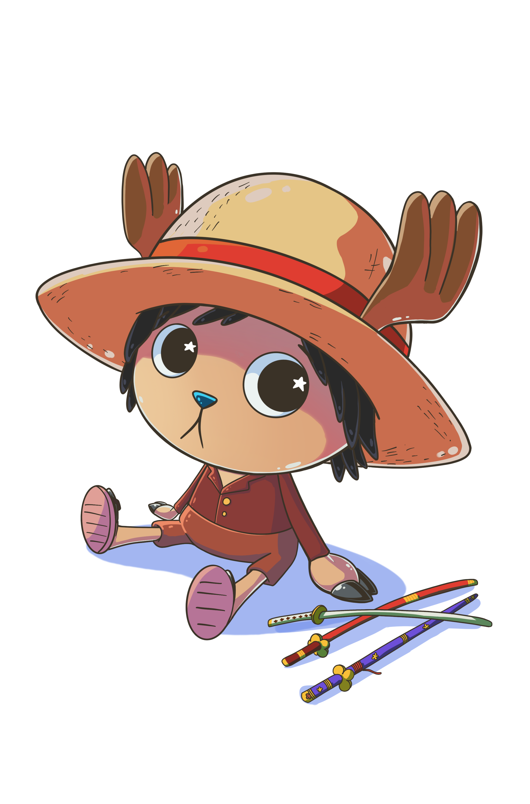

# **Choppify**

## ABOUT

I just wanted a cute app for Chopper <3.

 
 

## Skills used

 

## WEBSITE STRUCTURE

### ✦ Chopper container

You can see a container where you will be able to build your own chopper.

### ✦ Labels and buttons

On the right side (down if it's open on mobile device) you can see the labels with arrow buttons to be able to change individual parts of Chopper.

 
 

### ✦ Save button

On the bottom of labels panel is a Save button to download the image.

## KNOWLEDGE APPLIED

### ✦ HTML

A simple structure with 2 containers and buttons.

### ✦ CSS

I used Flex-box to display elements and create a responsive design.

### ✦ JavaScript

The mail goal for this project was use JavaScript language and be capable of interact with the main container and download a personalized image.

## MEME EXAMPLES

 
  

## RESOURCES

For this website I used different kinds of resources:

-   Icons -> [FontAwesome](https://fontawesome.com/)
-   Illustrations -> [Myself 💞](https://instagram.com/renga.art/)

## CONTACT ME

If you are interested in contacting me, as I say it on the project, you can find me on the following links:

-   [LinkedIn](https://www.linkedin.com/in/romina-yazm%C3%ADn-rao-50a61a1ba/)
-   [raoromina96@gmail.com](mailto:raoromina96@gmail.com)
-   [Instagram](https://instagram.com/renga.art/)
-   [Check my other GitHub repositories](https://github.com/RomiRao?tab=repositories)
